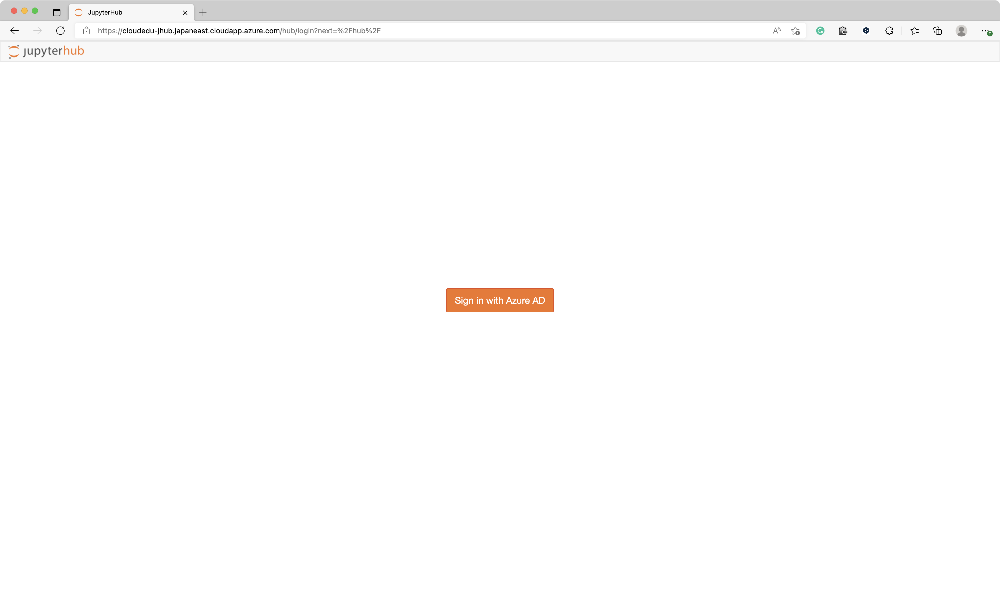
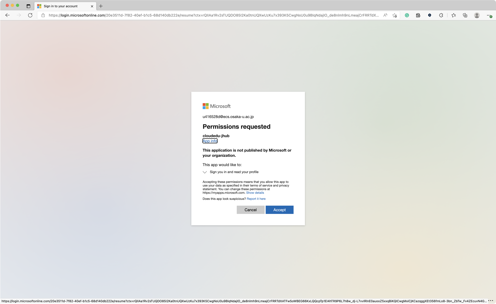

# Application registration

この講義用に準備した[JupyterHub](https://http://cloudedu-jhub.japaneast.cloudapp.azure.com/)にアクセスします。

多要素認証の設定を推奨する画面が出る場合がありますが、授業時間の制約のため `Skip for now (14 days until this is required)` を選択して先に進んで下さい。

`Permission required` と表示されるので `Accept` して下さい。

以上で、JupyterHubの設定が完了し、プログラムの実行が可能になります。
