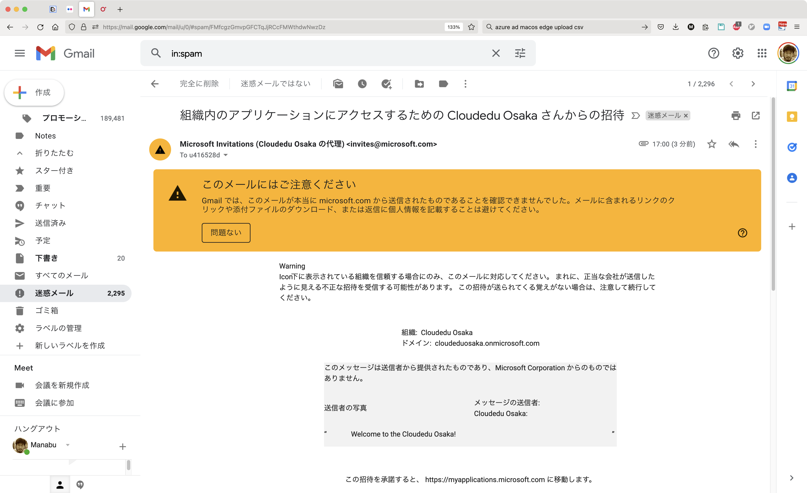
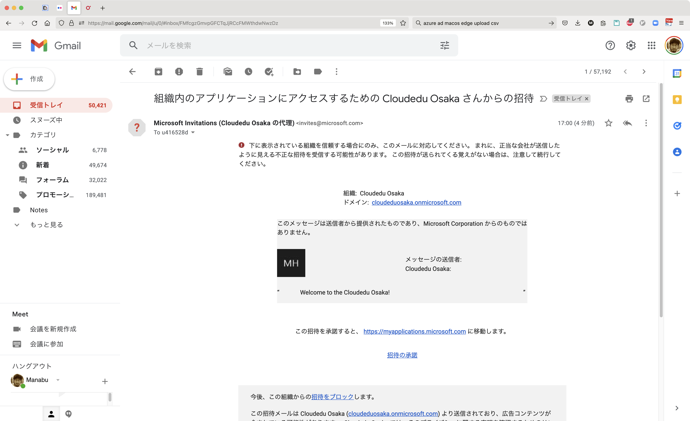
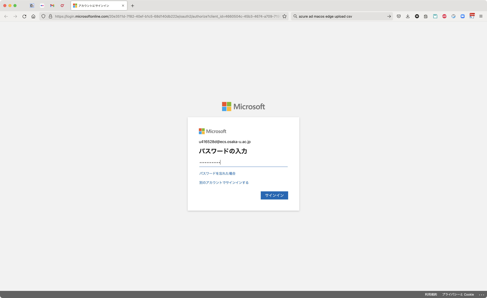

# Receiving invitation

## 招待メールの受信

阪大アカウント (`uXXXXXXx@ecs.osaka-u.ac.jp`) へ招待メールを送信します。
「組織内のアプリケーションにアクセスするための `Cloudedu Osaka` さんからの招待」というサブジェクトのメールを探してください。

```{attention}
高確率でスパムとして扱われるので、
受信フォルダに見当たらないときはスパム・フォルダを探して救出してください。

```

## 招待の承諾

「招待の承諾」というリンクをクリックしてください。



阪大アカウント (`uXXXXXXx@ecs.osaka-u.ac.jp`) のパスワードの入力画面に切り替わるので、パスワードを入力してください。



アクセス許可を与えて下さい。この講義では、この講義で使用するプログラミング環境への「サインイン」に用います。


```{attention}
一旦ここで全員の作業終了を待ちます。阪大アカウントのユーザ名が日本語で設定されているため、そのままでは作業フォルダの作成に失敗するためです。
```